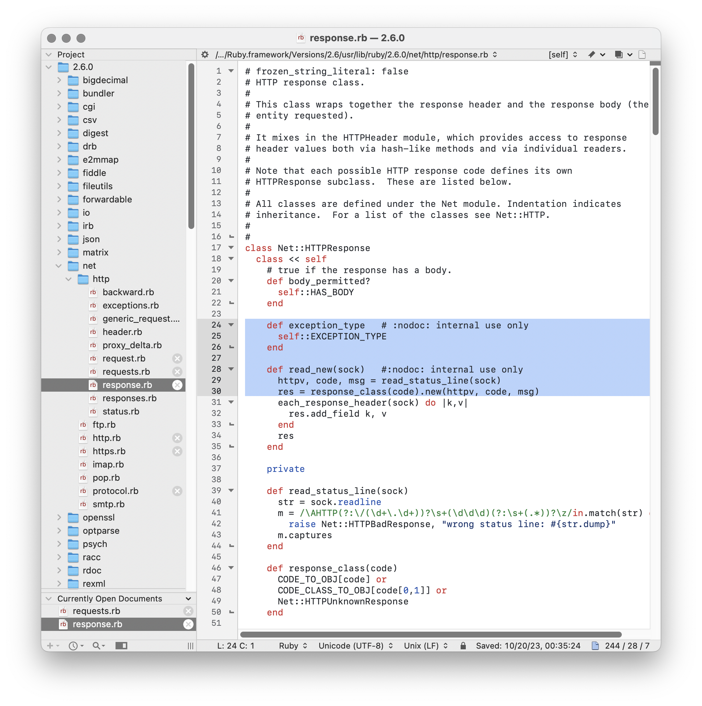

# Github-bbedit
GitHub Primer themes for BBEdit

## GitHub

## GitHub Dark

## GitHub Dark Dimmed

## References

* [Primer Colors](https://primer.style/foundations/color)
* [Github primer/primitives](https://github.com/primer/primitives)
* [VS Code Theme](https://github.com/primer/github-vscode-theme)
